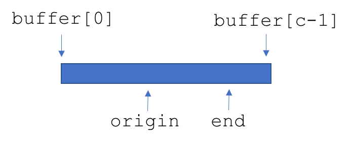
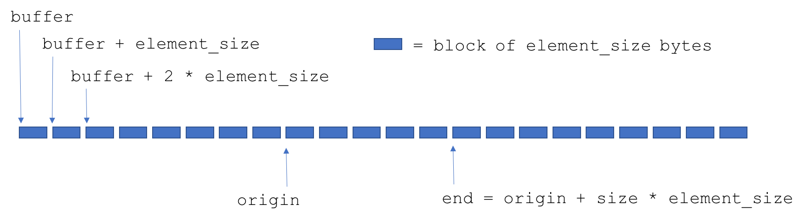

Week 3: Abstract Data Types
===

An *Abstract Data Type* (ADT) is a set of values and methods or operations that operate on those values. The interface to an ADT defines only how to build values and operate on them, but not how memory is allocated or how the operations are performed. ADTs are extremely useful to programmers. They allow you to
- avoid "reinventing the wheel" (and the explosion of many incompatible implementations of the "wheel")
- separate concerns: your user is concerned with other problems than how you implement array methods
- write cleaner code and
- provide a contract between you and other programmers.

High level, interpreted languages, such as Python or Javascript, come with built in ADTs for types such as arrays, lists, stacks, dictionaries, and even functions. However, C does not have any such nicities. Many code libraries have been build in C and C++ to provide these ADTs to C programmers. This week, we will see how to build our own ADT for arrays. Later in the course, we will be more complex ADTs for data types found in embedded systems such as processes, schedulers, finite state machines, sensors, and effectors.

Problems with C Arrays
===

Nothing makes you want an ADT more than raw C arrays. Here are some of the problems with arrays in C:
- Nothing prevents you from getting or setting outside of the memory allcoated for the array.
- An array does not know its own length. 
- Memory allocation should not be an array method.

An Array API
===

Following many standard abstract array types in other languages, we will implement an array type with the following operations on our array ADT:
- Make a new, empty, array.
- Destroy an array.
- Set elements of the array, as in `my_array[12] = 34`. Any non-negative index should be accepted.
- Get elements of the array, as in `x = my_array[54]`. Any non-negative index should be accepted, with default values for out of bounds queries.
- Return the size of the array.
- Push new values onto the beginning and ending of the array.
- Pop values from the beginning and ending of the array.
- Concatenate two arrays.
- Map functions onto arrays to get new arrays.
- Iterate through an array.

**Naming and argument conventions**: In languages with build in ADTs, the convention is to access a method like `push` of an array `a` with the notation:
```c
a.push(1)
```
In C, the `dot` notation does not allow such notation. Thus, all of our methods will be declared as stand alone functions in the global namespace. To avoid naming collisions, we will use the convention of
- Naming methods by the data type name followed by an underscore followed by the method name;
- Putting a pointer to the datum being operated upon as the first argument of the method (except for the constructor):
For example,
```c
DynamicArray * da = DynamicArray_new();
DynamicArray_push(da, 1);
```

Internal Memory Allocation 
===
We do not want the user of `DynamicArray` to worry about memory allocation. We also want array operations like getting, setting, pushing and popping to be fast, so reallocating the memory associated with a DynamicArray should happen rarely. To achieve these goals, we will use the following scheme:



- Start out with a buffer of given length, say 100. Call this the `capacity`.
- Keep track of two indices into the buffer, `origin` and `end`. 
- Initially put `origin = end = capacity / 2`.
- As elements are added beyong `end`, change `end` to incude them.
- If an element is pushed to the front, decement `origin`.
- If an element is added that is beyond the capacity, increase the buffer size by 2. 

Constructors and Destructors
===

We need a place to store all of the information associated with a `DynamicArray`, which we will put in  a `struct` containing the associated information:
```c
typedef struct {
    int capacity,
        origin,
        end;
    double * buffer;
} DynamicArray;
```
which appears in the header file `DynamicArray.h`. 

Although users could user this `typedef` to make new values, they would need to know how much memory to allocate and how to initialize the `capacity` and so on. Functions that build or construct new ADT values are called *constructors*. Here is a constructor for `DynamicArray`:
```c
DynamicArray * DynamicArray_new(void) {
    DynamicArray * da = (DynamicArray *) malloc(sizeof(DynamicArray));
    da->capacity = DYNAMIC_ARRAY_INITIAL_CAPACITY;    
    da->buffer = (double *) calloc ( da->capacity, sizeof(double) ); 
    da->origin = da->capacity / 2;
    da->end = da->origin;
    return da;
}
```
Note that it takes new arguments are returns a pointer to a new `DynamicArray` object. It also refers to a constant that determines the initial capacity and that is defined in the header file.

Once a user is done with the array, we need to free the memory associated with it. We do not want the user to call `free(da->buffer)`, because that would imply they knew about how the memory was allocated in the first place. Thus, we provide a *destructor` as follows:
```c
void DynamicArray_destroy(DynamicArray * da) {
    free(da->buffer);
    da->buffer = NULL;
    return;
}
```
The user can thus write
```c
DynamicArray * da = DynamicArray_new();
DynamicArray_push(da, 1);
DynamicArray_destroy(da);
free(da);
```
Note the user has to do two things. First, tell the array to free its own internal memory. Second, the user has to free the struct associated with the array. If they just call `free(da)` with, then the pointer `da->buffer` will be deleted, but not the memory it points to! That would be a serious (but not uncommon) memory leak.

Note that the buffer pointer is set to `NULL`, which is usually the address `x0000000` in memory. We will use this fact to test whether a given `DynamicArray` is valid. That is, suppose the user made a new array, then destroyed it but did not free it, and then tried to push something onto it. That would result in the user pushing something to the address `NULL + end`, which would be a memory violation. To avoid this happening, we will add an assertion to our methods that states that the buffer cannot be `NULL` and if it is, to produce a runtime error. We do this with the C library `assert.h` as follows:
```c
/* in the header file */
#include <assert.h>

/* at the beginning of all method definitions */
assert(da->buffer != NULL);
```

If this assert fails, you would see a runtime error such as
```bash
test: dynamic_array.c:82: void DynamicArray_set(DynamicArray*, int, double): Assertion `da->buffer != __null' failed.
Aborted
```

Getters
===

A getter is a method that "gets" information about an object. A simple bit of information about a `DynamicArray` is its size, for which we define the following method:
```c
int DynamicArray_size(const DynamicArray * da) {
    assert(da->buffer != NULL);
    return da->end - da->origin;
}
```
Note the assertion at the beginning of the method. 

The other obvious getter is the one that returns the value of the array at a given index. This is implemented as follows:
```c
double DynamicArray_get(const DynamicArray * da, int index) {
    assert(da->buffer != NULL);
    assert(index >= 0);
    if ( index > DynamicArray_size(da) ) {
        return 0;
    } else {
        return da->buffer[index_to_offset(da,index)];
    }
}
```
It includes another assertion: that the index is non-negative. It also checks to see if the index as out of bounds (using the `_size` method), and if it is, then it returns zero. The alternative to the out of bounds index would be to throw an error, but since we have decided that arrays can grow without bounds, we have decided to return a default value. Zero is also the value that `calloc` uses to initialize the array buffer, so this choice seems reasonable.

The getter also uses a `private` function that converts an index to a buffer offset. Because this conversion happens so often in our implementation, we've added them to the `dynamic_array.c` as follows:
```c
static int index_to_offset ( const DynamicArray * da, int index ) {
    return index + da->origin;
}

static int offset_to_index ( const DynamicArray * da, int offset ) {
    return offset - da->origin;
}
```
Sure, they are simple functions, but they clearly show in the `_get` code the relationship that the index to `da->buffer` is an offset in the buffer, and not an index in the `DynamicArray`. They are also declared statically and do not have prototypes in the header file, because we don't want our user to ever call them directly.

Setters
===

A setter is a method that changes the value of an object. The main setter in the `DynamicArray` is the `_set` method, which simply changes the value at a given index. If we did not care about memory allocation, we could simply write:
```c
void DynamicArray_set(DynamicArray * da, int index, double value) {
    da->buffer[index_to_offset(da, index)] = value;
}
```
However, if the user supplies a large enough index, the computed offset will exceed the bounds of the buffer. Thus, we should check the bounds first and extend the buffer if necessary. This leads to the code:
```c
void DynamicArray_set(DynamicArray * da, int index, double value) {
    assert(da->buffer != NULL);
    assert ( index >= 0 );
    while ( out_of_buffer(da, index_to_offset(da, index) ) ) {
        extend_buffer(da);
    }
    da->buffer[index_to_offset(da, index)] = value;
    if ( index > DynamicArray_size(da) ) {
        da->end = index_to_offset(da,index);
    }
}
```
This method has thre main steps. First, while the computed offset is out of bounds, extend the buffer. The extension is done with a help function described below. Putting the entire extension code in the `_set` method would make it very long and hard to read. Plus, there may be other opportunities to use the extend method and we do not want the same code showing up twice. Second, we set the element at the desired index to the specified value. Finally, we change the `end` index if needed. 

To extend the buffer, we want to keep the original buffer roughly in the middle of the new buffer. Here is the scheme we will use.

The extend method makes a new buffer and then makes temporary `new_origin` and `new_end` variables. The values of these must take into account the fact that the new origin offset is not the same value as the old origin offset, since the capacity has increased. We also want to reposition the array into the middle of the buffer, as the following figure shows:


The extend method will be a private method, defined statically in the impelemntation file as follows:
```c
static void extend_buffer ( DynamicArray * da ) {

    double * temp = (double *) calloc ( 2 * da->capacity, sizeof(double) );
    int new_origin = da->capacity - (da->end - da->origin)/2,
           new_end = new_origin + (da->end - da->origin);

    for ( int i=0; i<DynamicArray_size(da); i++ ) {
        temp[new_origin+i] = DynamicArray_get(da,i);
    }

    free(da->buffer);
    da->buffer = temp;
    da->capacity = 2 * da->capacity;
    da->origin = new_origin;
    da->end = new_end;

    return;
}
```
The method allocates a temporary pointer to a new buffer, defines the new offsets, copies the existing array, frees the old buffer, and then updates the struct elements that define the array. Note that the method uses the `_get` method, which is described below. The version of this method did not use the `_get` method, but as the rest of the library was built, it seemed reasonable to substitute it in for clarity.

The DRY Principle
===

In programming, DRY stands for "don't repeat yourself". We have used it above in a couple of places. First, we defined the relationship between array indices and buffer offsets in one place. This is also know as "Single source of truth". Second, we define the extend buffer method separately from the `_set` method. This is because we know that other methods, such as `_push_` and `_push_front` may need to extend the array as well. 

DRY practices makes code easier to maintain. If you change how you want to extend memory in the array, you only have to change the implemenation in one place, instead of tracking down every method that extends the memory.

By the way, the opposite of DRY is WET: "write everything twice" or "we enjoy typing"!

Visualizing an Array
===

It is very useful to have a method that converts an ADT into a string so you can print it. To do this in C, we define a method that dynamically allocates a string, prints into it, and the returns the array. The method we use to print into a string is called `snprintf`. The name comes from `sprintf`, which stands for "string printf". The `n` comes from the second argument to `snprintf`, which sets a limit on how big the resulting string can be. We have reserved 20 bytes for each float (and possible comma between values in the array). But since we do not know how much space a printed double will take in the worse case, we have to be careful to prevent memory overflows. The `_to_string` method for `DynamicArray` is as follows:
```c
char * DynamicArray_to_string(const DynamicArray * da) {
    assert(da->buffer != NULL);
    char * str = (char *) calloc (20,DynamicArray_size(da)),
         temp[20];
    int j = 1;
    str[0] = '[';
    for ( int i=0; i < DynamicArray_size(da); i++ ) {
        if ( DynamicArray_get(da,i) == 0 ) {
            snprintf ( temp, 20, "0" );
        } else {
            snprintf ( temp, 20, "%.5lf", DynamicArray_get(da,i) ); 
        }
        if ( i < DynamicArray_size(da) - 1 ) {
            sprintf( str + j, "%s,", temp);
            j += strlen(temp) + 1;
        } else {
            sprintf( str + j, "%s", temp);
            j += strlen(temp);
        }

    }
    str[j] = ']';
    return str;
}
```

To use this method, you need to make sure to free the string when you are done. Here is an example that uses the method to print out some debug information about a `DynamicArray`, showing the free method call at the end.
```c
void DynamicArray_print_debug_info(const DynamicArray * da) {
    char * s = DynamicArray_to_string(da);
    printf ( "%s\ncapacity: %d\norigin: %d\nend: %d\nsize: %d\n",
      s,
      da->capacity, 
      da->origin, 
      da->end,
      DynamicArray_size(da));
    free(s);
}
```

Pushing
===

Pushing a value onto the end of the array is straightforward and can be implemented using other methods.
```c
void DynamicArray_push(DynamicArray * da, double value ) {
    DynamicArray_set(da, DynamicArray_size(da), value );
}
```
Note that we do not even need to assert that the buffer is not null or extend it since the `_set` method takes care of that.

Pushing to the front of the array is almost as easy. If memory allocation were not an issue, we would simply decrement `da->origin` and then set the value at index zero. However, we need to check that `da->origin` is not zero first, and if it is, extend the buffer:
```c
void DynamicArray_push_front(DynamicArray * da, double value) {
    assert(da->buffer != NULL);    
    while ( da->origin == 0 ) {
        extend_buffer(da);
    }
    da->origin--;
    DynamicArray_set(da,0,value);
}
```

Popping
===

Popping elements off of the end or beginning of the array is similarly straightforward. The main things to do are
- Check that the array is not empty
- Zero out values beyond the new end of the array on popping.

```c
double DynamicArray_pop(DynamicArray * da) {
    assert(DynamicArray_size(da) > 0);
    double value = DynamicArray_get(da, DynamicArray_size(da)-1);
    DynamicArray_set(da, DynamicArray_size(da)-1, 0.0);
    da->end--;
    return value;
}

double DynamicArray_pop_front(DynamicArray * da) {
    assert(DynamicArray_size(da) > 0);
    double value = DynamicArray_get(da, 0);
    da->origin++;
    return value;    
}
```

Mapping
===

Mapping a function onto an array returns another array. Using the above methods, this meta-function is simple to write:
```c
DynamicArray * DynamicArray_map ( DynamicArray * da, double (*f) (double) ) {
    DynamicArray * result = DynamicArray_new();
    for ( int i=0; i<DynamicArray_size(da); i++ ) {
        DynamicArray_set(result, i, f(DynamicArray_get(da, i)));
    }
    return result;
}
```

Note that in testing this method, one might write:
```c
DynamicArray * t = DynamicArray_new(), * y;
double s = 0.0;
for ( int i=0; i<628; i++ ) {
    DynamicArray_set(t, i, s);
    s = s + 0.1;
}
y = DynamicArray_map(t,sin);
for (int i=0; i<DynamicArray_size(t); i++) {
    ASSERT_EQ(DynamicArray_get(y,i), sin(0.1*i));
}
DynamicArray_destroy(t);    
DynamicArray_destroy(y);  
```

Rounding Errors in Tests
===

Due to rounding errors, you might get this somewhat odd error message:
```bash
Expected equality of these values:
  DynamicArray_get(y,i)
    Which is: 0.564642
  sin(0.1*i)
    Which is: 0.564642
```
In this case, Google Test is not showing the full precision of the values, but at some point the numbers are not the same. Google Test has another method you can use instead:
```c
ASSERT_DOUBLE_EQ(DynamicArray_get(y,i), sin(0.1*i));
```
although even this seems to fail occasionally.

One method that does work is to use C's `float.h` library which defines a number called `DBL_EPSILON` smaller than which you should not trust a `double`. Then we can use Google Test's less-than assertion, `ASSERT_LT', to do:
```c
ASSERT_LT(
    abs(DynamicArray_get(y,i) - sin(0.1*i)),
    DBL_EPSILON
);
```
which seems more robust than `ASSERT_DBL_EQUAL`.

Arbitrary Array Values
===

One of the main problems with our dynamic array type is that it only works for arrays of doubles. In most higher languages, arrays work with any data type. Unforutnately, C does not provide a good way to manage types beyond telling you how much memory they take up. For example, you cannot pass a type as an argument into the `DynamicArray` constructor. The best we can do is to pass the size of a type to the constructor and the remember to cast when necessary.

In this section, we will build a new ADT called `AbitraryArray` with the goal to enable code such as the following to work.
```c
typedef struct {
    double x, y, z;
} Point;

AribtraryArray * a = AribtraryArray_new(sizeof(Point));
Point p;

for ( int i=0; i<10; i++ ) {
  p = { i, 0.5*i, 0.25*i };
  AribtraryArray_set_from_ptr( a, i, &p );
}

Point * q = (Point *) AribtraryArray_get_ptr(a,5);
printf ( "{%lf, %lf, %lf}", q->x, q->y, q->z );
```

The `_set_from_ptr` method takes a pointer to an element. This is because we can declare the third argment to the method to have type `void *`, meaning a pointer to something whose type we don't know. Unfortunately in C we can't specify an non pointer argument of unknown type, so this is the best we can do.

The `_get_ptr` method similarly returns a pointer to an element, instead of the element itself. Note that in the assignment to q we had to cast the result of `_get_ptr` to a point, since the method itself does not know what type to return.

> Note: In this ADT we will *copy* the value to the array upon a call to `_set_from_ptr`. A very good alternative would be instead to simply store the pointer itself. The main reason we do not do this now is because then the user would need to remember to `free` all the values pointed to by the array after every destructive operation. When we start working with C++, we will see that this is easy to do. 

The declarations of these methods are as follows:
```c
AribtraryArray * AribtraryArray_new(int);
void AribtraryArray_set_from_ptr(AribtraryArray *, int, void *);
void * AribtraryArray_get_ptr(const AribtraryArray *, int);
```
As you can see, the constructor now takes an argument that specifies the size of an element. The `_set_from_ptr` method takes a `void *` pointer to an element we will *copy* into the array. The `_get_ptr` returns a `void *`, which we will have to cast if we want to use it subsequently.

To implement these methods, we need to change a few things in our implementation of double arrays. First, we need to add the element size to the `struct` that describes an array and change the type of the buffer from `double *` to an arbitrary array of bytes.
```c
typedef struct {
    int capacity,
        origin,
        end,
        element_size;
    char * buffer;
} AribtraryArray;
```
In the constructor, we can now use use the element size to allocate the buffer and set the `origin` an `end` offsets. 
```c
AribtraryArray * AribtraryArray_new(int element_size) {
    AribtraryArray * da = (AribtraryArray *) malloc(sizeof(AribtraryArray));
    da->element_size = element_size;
    da->capacity = DYNAMIC_ARRAY_INITIAL_CAPACITY;
    da->buffer = (char *) calloc ( 
        da->capacity, 
        element_size
    ); 
    da->origin = ( da->capacity / 2 ) * da->element_size;
    da->end = da->origin;
    return da;
}
```
Note that in the original implementation, the `origin` and `end` offsets were essentially indices into the array of doubles, with C doing the pointer arithmetic for us. Here, however, we need to do the pointer arithmetic ourselves. 



The new helper methods now uses the element size.
```c
static int index_to_offset ( const AribtraryArray * da, int index ) {
    return da->element_size * index + da->origin;
}

static int offset_to_index ( const AribtraryArray * da, int offset ) {
    return ( offset - da->origin ) / da->element_size;
}
```
To implement the `_set_from_ptr` method, we need to copy the bytes pointed to by the `ptr` argument into the appropriate place in the array. The C `<string.h>` library provides a useful method called `memcpy` that copies a certain number of bytes from one memory location into another, so we use it here.
```c
void ArbitraryArray_set_from_ptr(ArbitraryArray * da, int index, void * ptr) {
    assert(da->buffer != NULL);
    assert ( index >= 0 );
    while ( out_of_buffer(da, index_to_offset(da, index) ) ) {
        extend_buffer(da);
    }
    memcpy(da->buffer + index_to_offset(da, index), ptr, da->element_size);
    if ( index >= ArbitraryArray_size(da) ) {
        da->end = index_to_offset(da,index+1);
    }
}
```
Otherwise, this method is the same as the corresponding method in the `DynamicArray` ADT. This method does call `extend_buffer`, however, which needs to be re-implemented.
```c
static void extend_buffer ( ArbitraryArray * da ) {

    char * temp = (char *) calloc ( 2 * da->capacity, da->element_size );
    int new_origin = da->element_size * (
        da->capacity - (
            offset_to_index(da,da->end) - offset_to_index(da,da->origin)
        )/2
    );
    int new_end = new_origin + (da->end - da->origin);  

    for ( int i=0; i<ArbitraryArray_size(da); i++ ) {
        memcpy(temp + new_origin + i * da->element_size,
               da->buffer + da->origin + i * da->element_size,
               da->element_size);
    }

    free(da->buffer);
    da->buffer = temp;
    da->capacity = 2 * da->capacity;
    da->origin = new_origin;
    da->end = new_end;

}
```
Note that we use `memcpy` here as well. We also use the element size to compute the new centered offsets.

Finally, here is the implementation of `_get_ptr`:
```c
void * ArbitraryArray_get_ptr(const ArbitraryArray * da, int index) {
    assert(da->buffer != NULL);
    assert ( index >= 0 );
    if ( index >= ArbitraryArray_size(da) ) {
        return NULL;
    } else {
        return (void*) ( da->buffer + index_to_offset(da, index) );
    }
}
```
The main difference here is that we return a `void *` pointer instead of a `double`, similar to how `malloc` and `calloc` work. This is because the `ArbitraryArray` ADT does not know what the type of the value being pointed to is. We also use pointer arithmetic instead of array indexing to determine the address of the requested element.

As an example, here is how you could use `ArbitaryArray` to hold an array of pointers to `DynamicArray` elements.
```c
TEST(ArbitraryArray,OfPointers) {

    // Create the array that will hold the pointers
    ArbitraryArray * ptrs = ArbitraryArray_new(sizeof(DynamicArray *));

    // Create a couple of dynamic arrays
    DynamicArray * a = DynamicArray_new(),
                            * b = DynamicArray_new();

    // Add the dynamic arrays to the pointer array
    ArbitraryArray_set_from_ptr(ptrs, 0, &a);
    ArbitraryArray_set_from_ptr(ptrs, 1, &b);

    // Get them back. Note that because the array contains pointers,
    // and _get_ptr returns a pointer to a pointer, we need to cast
    // its result as a pointer to a DynamicArray pointer.
    DynamicArray ** ptr_a = (DynamicArray **) ArbitraryArray_get_ptr(ptrs,0);
    DynamicArray ** ptr_b = (DynamicArray **) ArbitraryArray_get_ptr(ptrs,1);

    // Check that the pointers are equal
    ASSERT_EQ(*ptr_a, a);
    ASSERT_EQ(*ptr_b, b);
    ASSERT_NE(*ptr_a, b);
    ASSERT_NE(*ptr_b, a);

}
```

The `ArbitraryArray` ADT described here is for pedagogical purposes only. It has many problems, such as the following:
- Users have to remember to cast results.
- You have to create each element twice, one to construct it and then once to copy it into the array.

Exercises (due Friday Feb 1, extended to Sunday Feb 3)
===

> Note: You should copy the ECEP520/week_2/arrays directory to EE590/hw_3 to use as the starting point for your homework. All function prototypes for the methods you need to define are contained in the header files.

> Note: The prototypes for these exercises are given in the header files in the `week_2/arrays` directory of the `ECEP520` repository.

> Note: We highly recommend that you write tests for a method you are creating *before* you implement it. We also recommend that you compile your code with the example `unit_test.c` file that the TAs provide before you turn in your homework.

1. Implement the following mathematical operations for `DynamicArray`. They should all assert that the array is not empty.
    - `_min`: returns the minimum value in the array. 
    - `_max`: returns the maximum value in the array.
    - `_mean_`: returns the average value in the array.
    - `_median`: returns the median value in the array.
    - `_sum`: returns the sum of the values in the array (does not need to assert non-empty).
1. For the `DynamicArray` ADT, write the methods `_last` and `_first` which return the value at the end or beginning of the array, respectively. Refactor `pop` and `pop_front` to use these methods. Note that last and first should assert that the array is not empty.
1. Write a `_copy` method that produces a copy of an array. It should return an entirely new `DynamicArray` object. Refactor `_map` to use `_copy` instead of `_new`.
1. Write a method called `_range` that creates a new dynamic array with values as follows:
    ```c
    DynamicArray * a = DynamicArray_range(0, 1, 0.1); /* yields [ 0, 0.1, 0.2, ..., 1.0 ] */
    ```
1. Implement the method `_concat`, which concatenates two arrays to produce a new array. For example,
    ```c
    DynamicArray * a = DynamicArray_range(0, 1, 0.1);
    DynamicArray * b = DynamicArray_range(1.1, 2, 0.1);
    DynamicArray * c = DynamicArray_concat(a, b); /* yeilds [ 0, 0.1, ..., 2.0 ] */
    ```
1. Implement a method called `_take` that returns a sub-array of `n` elements. If the argument positive, it takes from the beginning. If it is negative it takes from the end. If there are not enough elements, the method should return as many as it can and set the rest to zero. For example:
    ```c
    DynamicArray * a = DynamicArray_range(1, 5, 1);
    DynamicArray * b = DynamicArray_take(a, 2);  /* yields [ 1, 2 ] */
    DynamicArray * c = DynamicArray_take(a, -2); /* yields [ 4, 5 ] */
    DynamicArray * d = DynamicArray_take(a, 7);  /* yields [ 1, 2, 3, 4, 5, 0, 0 ] */
    ```
1. Implement a `_to_string` method for `ArbitraryArray` that takes a function that builds a string representation of an element. The following test should pass:
    ```c
    typedef struct {
        double x, y, z;
    } Point;

    char * point_to_string ( void * p ) {
        Point * q = (Point *) p;
        char * str = (char *) calloc(40, sizeof(char));
        snprintf(str,40,"{%.1lf,%.1lf,%.1lf}", q->x, q->y, q->z);
        return str; /* note: must be freed by the user */
    }

    namespace {
        TEST(ArbitraryArray, ToString) {
            Point p = { 1,2,3 }, q = { 4,5,6 };
            ArbitraryArray * a = ArbitraryArray(sizeof(Point));
            char * s = ArbitraryArray_to_string(a,point_to_string);
            ASSERT_STREQ(s, "{1.0,2.0,3.0},{4.0,5.0,6.0}");
            ArbitraryArray_destroy(a);
            free(a);
            free(c);
        }
    }
    ```
    Make sure to free the string returned by the second argument to the `_to_string` method within the `_to_string` method.
1. Modify the `DynamicArray` ADT so that all constructors (`_new`, `_copy`, `_range`, `_take`, `_subarray` and `_concat`) count the number of arrays that have been constructed so far. 
    - Create a method `_num_arrays` that returns the number of allocated arrays.
    - Create another method `_destroy_all` that destroys all allocated arrays.
    - Create a method `_is_valid` that determines whether an array has been deallocated or not (i.e. whether its `buffer` is NULL).
    As an example, the following test should pass:
    ```c
    DynamicArray * a = DynamicArray_range(0, 1, 0.1);
    DynamicArray * b = DynamicArray_range(1.1, 2, 0.1);
    DynamicArray * c = DynamicArray_concat(a, b);
    ASSERT_EQ(DynamicArray_is_valid(a), 1);
    ASSERT_EQ(DynamicArray_num_arrays(), 3);
    DynamicArray_destroy_all();
    ASSERT_EQ(DynamicArray_is_valid(a), 0);
    ASSERT_EQ(DynamicArray_num_arrays(), 0);
    free(a);
    free(b);
    free(c);
    ```