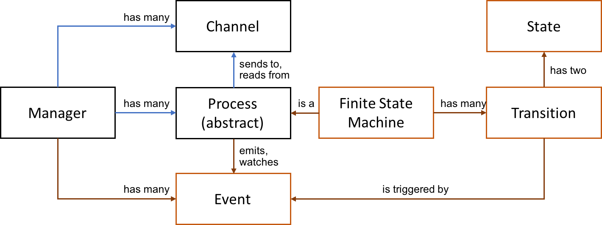
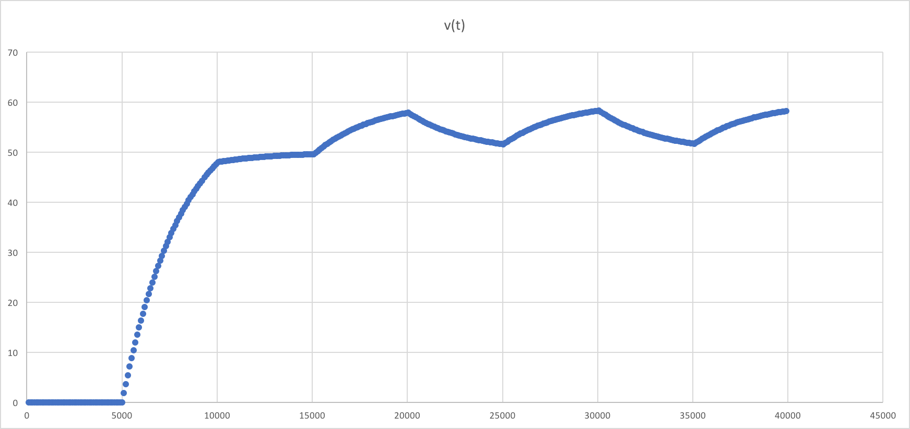

Week 7: Events and Finite State Machines
===

Note about projects
===

Projects will be assigned in week 8 lecture and due the Friday of finals week. I will give you a list of topics to choose from. 

Architecture
===
Last week we built a simple process manager that included an abstract base class, `Process`, from which users can derive their own processes. We also defined a `Channel` class that enabled processes to send streams of values to each other.



This week we will
- Upgrade the `Channel` class to enable sending *JSON* data, instead of just `double` values.
- Add a new interprocess communication `Event` class.
- Add a set of classes for defining *Finite State Machines*.
- Improve the test coverage of Elma.

The resulting structure looks like the above. Orange indicates classes that we will define today.

JSON
===

The *Javascript Object Notation* or [JSON](http://www.json.org/) standard is a file and data format used almost ubiquitously in networked systems. It has become the standard way to represent arbitrary data types in a structured way, and to allow applications to communicate without much overhead in defining data structures and types. It is even used in some of the most popular databases, such as MongoDB, as the fundamental data structure for defining documents.

Some examples of where JSON is used include
- [Vehicle APIs](https://www.scip.ch/en/?labs.20180405)
- [Industrial Automation](https://openautomationsoftware.com/)
- [Databases](https://www.mongodb.com/)
- [Google Maps](https://www.sitepoint.com/google-maps-json-file/)
- [NOAA Data Services](https://www.ncdc.noaa.gov/access-data-service/api/v1/data?dataset=global-summary-of-the-year&dataTypes=DP01,DP05,DP10,DSND,DSNW,DT00,DT32,DX32,DX70,DX90,SNOW,PRCP&stations=ASN00084027&startDate=1952-01-01&endDate=1970-12-31&includeAttributes=true&format=json)

Data Representation in JSON
---

JSON allows a broad range of data to be represented as strings of characters. For example,
```json
{
    "tas": [
        {
            "first": "Justin",
            "last": "Vrana"
        },
        {
            "first": "Kung-Hung",
            "last": "Lu",
            "aka": "Henry"
        }
    ],
    "weeks": [ 1, 2, 3, 4, 5, 6, 7, 8, 9, 10 ],
    "version": 2.0
}
```
In a JSON string, you can represent
- Atomic values
    - strings delimited by double quotes
    - numbers, with or without decimals
    - true and false
    - null
- Arrays of values atomic values, objects and/or otjer arrays, delimited by [ and ]. 
- Objects with key value pairs, where values are atomic, objects, or arrays

The two key methods that one needs to support JSON in an application are

- *Serialization*, also knownn as *stringification*: Converting an application data structure into a JSON string.
- *Deserialization*, also known as *parsing*: Converting a JSON string into an application data structure.

For example, open the console on your web browser and type
```javascript
str = '{ "a": 1, "b": [2,3], "k": { "c": { "d": true } } }';
x = JSON.parse(str); 
x.k.c.d; // true
JSON.stringify(x);
```

Note that if your string has a format error in it, you will get an error when you try to deserialize it:
```javascript
JSON.parse('{"x": [1,2}')
```
which results in the useful message:
```
VM282:1 Uncaught SyntaxError: Unexpected token } in JSON at position 10
    at JSON.parse (<anonymous>)
    at <anonymous>:1:6
```

Adding JSON to your code (and to Elma)
---

The docker container we have been using has been upgraded to include the nlohmann/json library. You can build it from the new Dockerfile is in cppenv-json in this repository with the commands
```bash
cd cppenv-json
docker build -t cppenv-json .
cd ..
docker run -v $PWD:/source -it cppenv-json bash
```
or just use Prof. Klavins' pre-compiled image via Dockerhub with the command
```bash
docker run -v $PWD:/source -it klavins/ecep520:cppenv-json bash
```

Within this container, you can use the JSON library simply by including it.
```c++
#include <json/json.h>

using nlohmann::json; 
```

The JSON C++ Library
---

The JSON C++ library we will use is described in detail [here](https://github.com/nlohmann/json). For now, we will use a subset of the library's capabilties, mainly defining and accessing JSON values.

To defining a JSON value, you can simply declare it with the json type and assign it to a C++ value. For example,
```c++
json j = 3.14,
     k = "hello world",
     l = { 1,2,3 };
```
defines three JSON values with raw types double, string, and integer array. Note that since C++ does not use [ and ] to define arrays, we have to use { and }. 

Since C++ does not have built in hash-like objects, to define an object, you have to use a special notation that does not look much like JSON. For example,
```c++
json j = { { "x", 0 }, { "y", 1 } }; // { "x": 0, "y": 1 }
```
and if you want to define a nested object, you can write
```c++
json j = {
    { 
        "tas", {
            {
                { "first", "Justin" },
                { "last", "Vrana" }
            },
            {
                { "first", "Kung-Hung" },
                { "last", "Lu" },
                { "aka",  "Henry" }
            }
        },
    },
    { 
        "weeks", { 1, 2, 3, 4, 5, 6, 7, 8, 9, 10 } 
    },
    { 
        "version", 2.0
    }
}
```
You can also serialize a string directly in a definition, as in
```c++
json x = R"('{ "a": 1, "b": [2,3], "k": { "c": { "d": true } } }')"_json;
```
This magical bit of code uses the C++ [raw string operator](http://www.cplusplus.com/forum/general/190123/). The `_json` bit at the end is using a [user defined literal](https://en.cppreference.com/w/cpp/language/user_literal) (defined in the JSON library). 

You can also define json values from 

To access parts of a json object, you use notation such as
```c++
int a = x["a"]; // 1
bool d = x["k"]["c"]["d"]; // true
```
Note that the assignment operator `=` has been overloaded to convert any kind of json value into a C++ value (such as `int` and `bool` above). You will get a runtime error if the value cannot be converted. For example, if you do
```c++
double k = x["k"];
```
you will get
```
C++ exception with description "[json.exception.type_error.302] type must be number, but is object" thrown in the test body.
```
This brings up one of the downsides of using JSON. With C++ you normally cannot even compile code that tries to assign a value of one type to an incompatible value of another time. But with JSON you can. If you would like to be very explicit, you can instead do
```c++
double k = x["k"].get<double>();
```
which uses the templated `get` method of the library. However, this will still throw a runtime error, since the compiler can't keep track of what values `x` may take on without running the program.

Upgrading Channels to use JSON
===

The JSON library is incredibly easy to use. To modify the `Channel` object, we literally replace the keyword `double` with the type `json`. In the header file:
```c++
class Channel {

    ...

    public:
    Channel& send(json);

    ...

    private:
    deque<json> _queue;

    ...

};
```
and in the implementation file
```c++
Channel& Channel::send(json value) {
    _queue.push_front(value);
    while ( _queue.size() > capacity() ) {
        _queue.pop_back();
    }
    return *this;
}
```
And example of the use of the new channel can be found in `ECEP520/week_7/elma/examples/feedback.cc`, which is a rewrite of the cruise control example from last week.

New Directory Structure
===

While we are on the subject of examples, we have changed the structure of the directories in the code base. We now have:
```
/elma
    channel.cc
    channel.h
    ...
    Makefile
    ...
    /examples
        basic.cc
        feedback.cc
        Makefile
        bin
            basic
            feedback
    /test
        channel.cc
        event.cc
        ...
        main.cc
        Makefile
        bin
            test
```
There is a `Makefile` in the examples directory and another in the test directory. The examples directory makes a separate executable for each example. The tests are named after the class they are intended to test. The main file runs every test defined in any of the test files.

Events
===

An *event* is a discrete occurrence that happens at a specific point in time. For example, a touch sensor might go from off to on, or a user might press a button. Events often have data associated with them. For example, how hard was the button pressed? To capture an event formally, we define a new class:
```c++
class Event {

    public:

    Event(json value) : _value(value) {}
    inline json value() const { return _value; }

    private:
    json _value;

};
```
We will expand upon this definition later, but for now, an event is little more than a container for a JSON value.

To use an event, processes need to be able to 
- **emit** an event, giving it a name in the process. The result should be that the manager broadcasts the occurence of the event to any other processes that are watching for it.
- **watch** for events with a specific name, responding to them with user defined functions.

Thus, to the `Manager` we add a private data member
```c++
// manager.h
private:
map<string, vector<std::function<void(Event&)>>> event_handlers;
```
Next we add a `watch` method to Manager and a wrapper for it to `Process`.
```c++
// manager.cc
Manager& Manager::watch(string event_name, std::function<void(Event&)> handler) {
    event_handlers[event_name].push_back(handler);
    return *this;
}

// process.cc
void Process::watch(string event_name, std::function<void(Event&)> handler) {
    _manager_ptr->watch(event_name, handler);
}
```
Typically, processes should set up event handlers in their `init` methods. For example, you could do
```c++
// Cruise control process watching for desired speed events from the driver
void init() {
    watch("desired speed", [this](Event& e) {
        desired_speed = e.value();
    });
}
```
See `examples/driving.cc` for a worked out example. A plot of the velocity over time from that example is here:



To emit an event, we define a `Manager` method and a `Process` wrapper that searches the event handler list for handlers that correspond to the emitted event.
```c++
// Manager.cc
Manager& Manager::emit(string event_name, const Event& event) {
    if ( event_handlers.find(event_name) != event_handlers.end() ) {
        for ( auto handler : event_handlers[event_name] ) {
            handler(e);
        }
    }
    return *this;
}

// Process.cc
void Process::emit(string event_name, const Event& event) {
    _manager_ptr->emit(event_name, event);
}
```

A process would typically emit an event in its `start`, `update`, or `stop` method. For example,
```c++
void update() {
    emit("desired speed", Event(desired_speed));
}
```

Finite State Machines
===

States
---

Transitions
---

State Machines
---

Example
---

Elevator: https://courses.cs.washington.edu/courses/cse466/02au/Lectures/State-models.pdf

Documentation with Doxygen
---

Exercises
===
